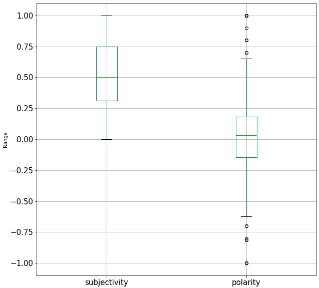
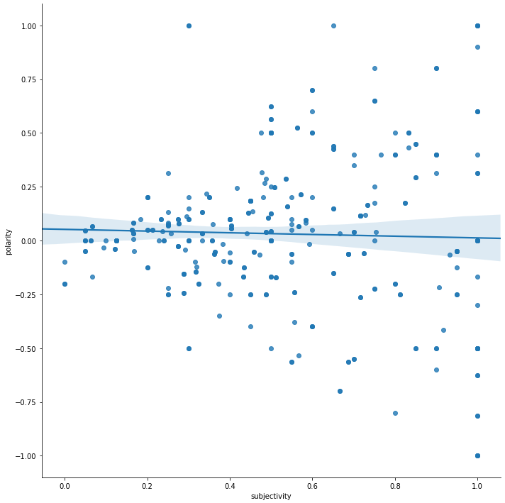
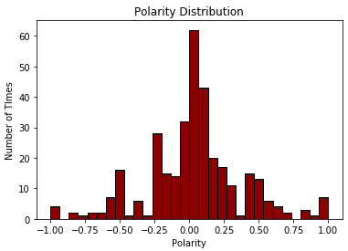
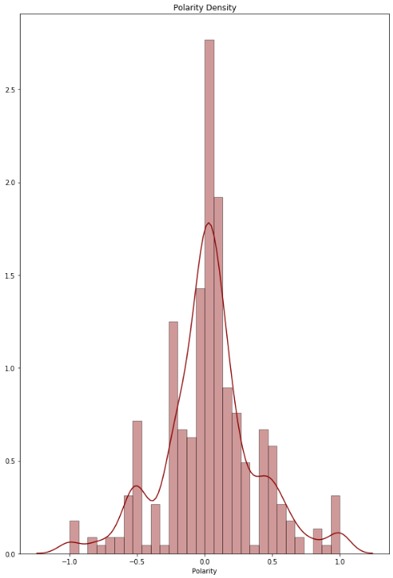
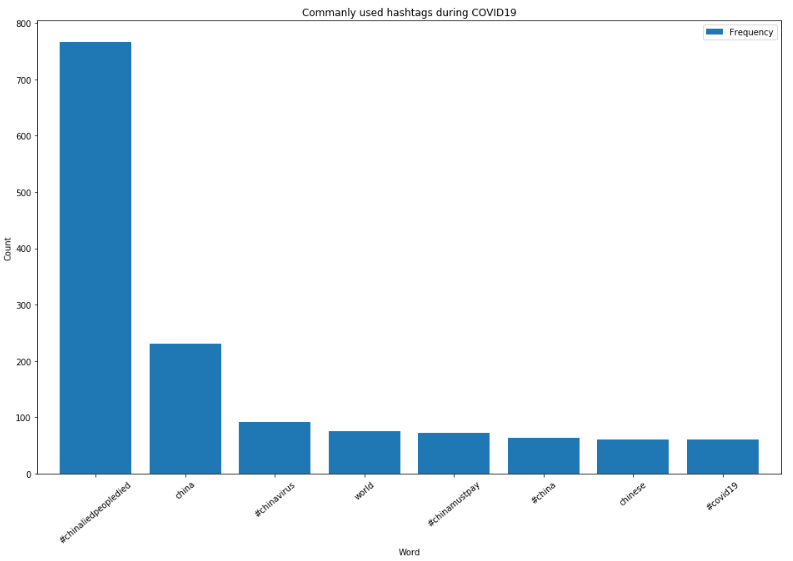
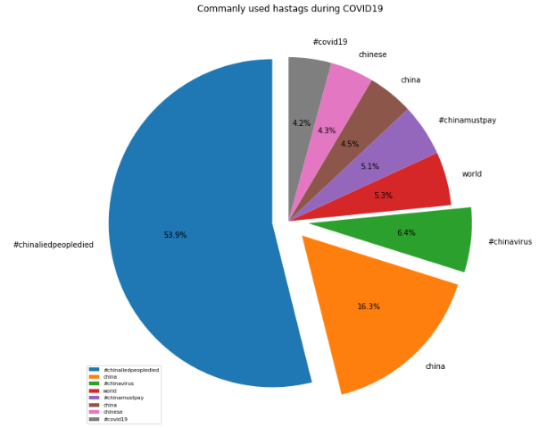
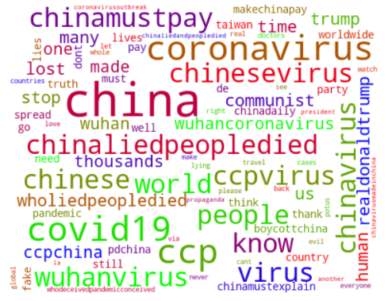

# Racism Towards China

### Installing twitterscraper

```python
pip install twitterscraper
```

#### Output

```
Requirement already satisfied: twitterscraper in c:\users\kusam\anaconda3\lib\site-packages (1.4.0)
Requirement already satisfied: lxml in c:\users\kusam\anaconda3\lib\site-packages (from twitterscraper) (4.4.1)
Requirement already satisfied: coala-utils~=0.5.0 in c:\users\kusam\anaconda3\lib\site-packages (from twitterscraper) (0.5.1)
Requirement already satisfied: requests in c:\users\kusam\anaconda3\lib\site-packages (from twitterscraper) (2.22.0)
Requirement already satisfied: bs4 in c:\users\kusam\anaconda3\lib\site-packages (from twitterscraper) (0.0.1)
Requirement already satisfied: billiard in c:\users\kusam\anaconda3\lib\site-packages (from twitterscraper) (3.6.3.0)
Requirement already satisfied: chardet<3.1.0,>=3.0.2 in c:\users\kusam\anaconda3\lib\site-packages (from requests->twitterscraper) (3.0.4)
Requirement already satisfied: urllib3!=1.25.0,!=1.25.1,<1.26,>=1.21.1 in c:\users\kusam\anaconda3\lib\site-packages (from requests->twitterscraper) (1.24.2)
Requirement already satisfied: certifi>=2017.4.17 in c:\users\kusam\anaconda3\lib\site-packages (from requests->twitterscraper) (2019.9.11)
Requirement already satisfied: idna<2.9,>=2.5 in c:\users\kusam\anaconda3\lib\site-packages (from requests->twitterscraper) (2.8)
Requirement already satisfied: beautifulsoup4 in c:\users\kusam\anaconda3\lib\site-packages (from bs4->twitterscraper) (4.8.0)
Requirement already satisfied: soupsieve>=1.2 in c:\users\kusam\anaconda3\lib\site-packages (from beautifulsoup4->bs4->twitterscraper) (1.9.3)
Note: you may need to restart the kernel to use updated packages.
```

### Importing all the necessary libaries

```python
from twitterscraper import query_tweets
import pandas as pd
import datetime as dt
from textblob import TextBlob
from itertools import islice
import matplotlib.pyplot as plt
import seaborn as sns
```

#### Output

```
INFO: {'User-Agent': 'Opera/9.80 (X11; Linux i686; Ubuntu/14.10) Presto/2.12.388 Version/12.16'}
```

### Pulling the only the english tweets from 2/10/2020 till 5/20/2020

```python
begin_date = dt.date(2020,2,10)
end_date = dt.date(2020,5,20)

limit = 1000
lang = 'English'
```

### Filtering based on hashtag #chinaliedpeopledied

```python
tweets = query_tweets('#chinaliedpeopledied', begindate = begin_date, enddate = end_date, limit = limit, lang = lang)
```

#### Output

```
INFO: queries: ['#chinaliedpeopledied since:2020-02-10 until:2020-02-15', '#chinaliedpeopledied since:2020-02-15 until:2020-02-20', '#chinaliedpeopledied since:2020-02-20 until:2020-02-25', '#chinaliedpeopledied since:2020-02-25 until:2020-03-01', '#chinaliedpeopledied since:2020-03-01 until:2020-03-06', '#chinaliedpeopledied since:2020-03-06 until:2020-03-11', '#chinaliedpeopledied since:2020-03-11 until:2020-03-16', '#chinaliedpeopledied since:2020-03-16 until:2020-03-21', '#chinaliedpeopledied since:2020-03-21 until:2020-03-26', '#chinaliedpeopledied since:2020-03-26 until:2020-03-31', '#chinaliedpeopledied since:2020-03-31 until:2020-04-05', '#chinaliedpeopledied since:2020-04-05 until:2020-04-10', '#chinaliedpeopledied since:2020-04-10 until:2020-04-15', '#chinaliedpeopledied since:2020-04-15 until:2020-04-20', '#chinaliedpeopledied since:2020-04-20 until:2020-04-25', '#chinaliedpeopledied since:2020-04-25 until:2020-04-30', '#chinaliedpeopledied since:2020-04-30 until:2020-05-05', '#chinaliedpeopledied since:2020-05-05 until:2020-05-10', '#chinaliedpeopledied since:2020-05-10 until:2020-05-15', '#chinaliedpeopledied since:2020-05-15 until:2020-05-20']
INFO: Got 2 tweets (2 new).
INFO: Got 4 tweets (2 new).
INFO: Got 6 tweets (2 new).
INFO: Got 8 tweets (2 new).
INFO: Got 38 tweets (30 new).
INFO: Got 95 tweets (57 new).
INFO: Got 153 tweets (58 new).
INFO: Got 211 tweets (58 new).
INFO: Got 268 tweets (57 new).
INFO: Got 321 tweets (53 new).
INFO: Got 377 tweets (56 new).
INFO: Got 434 tweets (57 new).
INFO: Got 485 tweets (51 new).
INFO: Got 543 tweets (58 new).
INFO: Got 601 tweets (58 new).
INFO: Got 659 tweets (58 new).
INFO: Got 717 tweets (58 new).
INFO: Got 773 tweets (56 new).
INFO: Got 773 tweets (0 new).
INFO: Got 773 tweets (0 new).
```

### Tweets into Dataframe

```python
df = pd.DataFrame(t.__dict__ for t in tweets)
df.to_csv('out.csv',index=False)
COLS = ['date','text', 'sentiment','subjectivity','polarity']
df_new = pd.DataFrame(columns=COLS)
```

### Calculating subjectivity and polarity

```python
for index, row in islice(df.iterrows(), 0, None):

    new_entry = []
    text_lower = row['text'].lower()
    blob = TextBlob(text_lower)
    sentiment = blob.sentiment
    polarity = sentiment.polarity
    subjectivity = sentiment.subjectivity

    new_entry += [row['text'], text_lower, sentiment, subjectivity, polarity]

    single_survey_sentiment_df = pd.DataFrame([new_entry], columns = COLS)
    df_new = df_new.append(single_survey_sentiment_df, ignore_index = True)
```

### Understand the

```python
df_new.describe()
```

#### Output

```
	    subjectivity	polarity
count	773.00000	    773.000000
mean	0.23347	        0.013396
std	    0.32258	        0.228795
min	    0.00000	        -1.000000
25%	    0.00000	        0.000000
50%	    0.00000	        0.000000
75%	    0.47500	        0.000000
max	    1.00000	        1.000000
```

### To check for rows with non zero values in a subset of columns in pandas dataframe

```python
dffilter = df_new.loc[(df_new.loc[:, df_new.dtypes != object] != 0).any(1)]
dffilter.describe()
```

#### Output

```
	    subjectivity	polarity
count	336.000000	    336.000000
mean	0.537120	    0.030819
std	    0.276072	    0.346546
min	    0.000000	    -1.000000
25%	    0.312500	    -0.145370
50%	    0.500000	    0.033333
75%	    0.750000	    0.183333
max	    1.000000	    1.000000
```

### To calculate neitral feedbacks

```python
x = len(df_new)
y = len(dffilter)
delta = x - y
print(delta)
```

### Boxplot for dffilter

```python
boxplot = dffilter.boxplot(column=['subjectivity','polarity'],
                     fontsize = 15,grid = True, vert=True,figsize=(10,10,))
plt.ylabel('Range')
```

### Output

Text(0, 0.5, 'Range')



### Scatter for dffilter

```python
sns.lmplot(x='subjectivity',y='polarity',data=dffilter,fit_reg=True,scatter=True, height=10,palette="mute")
```

### Output

<seaborn.axisgrid.FacetGrid at 0x2587e639888>



### Covariance and correlation for dffilter

### Calculate the covariance between two variables

```python
from numpy.random import randn
from numpy.random import seed
from numpy import cov
from scipy.stats import pearsonr

# prepare data
data1 = dffilter['subjectivity']
data2 = data1 + dffilter['polarity']
# calculate covariance matrix
covariance = cov(data1, data2)
print(covariance)

corr, _ = pearsonr(data1, data2)
print('Pearsons correlation: %.5f' % corr)
```

#### Output

[[0.07621574 0.07319532]
[0.07319532 0.19026933]]
Pearsons correlation: 0.60782

### Polarity Distribution for dffilter

```python
plt.hist(dffilter['polarity'], color = 'darkred', edgecolor = 'black', density=False,
         bins = int(30))
plt.title('Polarity Distribution')
plt.xlabel("Polarity")
plt.ylabel("Number of TImes")

from pylab import rcParams
rcParams['figure.figsize'] = 10,15
```



```python
sns.distplot(dffilter['polarity'], hist=True, kde=True,
             bins=int(30), color = 'darkred',
             hist_kws={'edgecolor':'black'},axlabel ='Polarity')
plt.title('Polarity Density')

from pylab import rcParams
rcParams['figure.figsize'] = 10,15
```



```python
import nltk
nltk.download()
```

#### Output

showing info https://raw.githubusercontent.com/nltk/nltk_data/gh-pages/index.xml
True

```python
stopwords = nltk.corpus.stopwords.words('english')

RE_stopwords = r'\b(?:{})\b'.format('|'.join(stopwords))
words = (df.text
           .str.lower()
           .replace([r'\|',r'\&',r'\-',r'\.',r'\,',r'\'', RE_stopwords], [' ', '','','','','',''], regex=True)
           .str.cat(sep=' ')
           .split()
)

from collections import Counter

```

### Generate DF out of Counter

```python
rslt = pd.DataFrame(Counter(words).most_common(10),
                    columns=['Word', 'Frequency']).set_index('Word')
rslt
```

#### Output

```
	                    Frequency
    Word
#chinaliedpeopledied	766
…	                   264
china	               231
#chinavirus	          91
’	                    81
world	                75
#chinamustpay	        73
#china	               64
chinese	              61
#covid19	             60
```

```python
rslt=rslt.drop(['…'],axis=0)
rslt=rslt.drop(['’' ],axis=0)
rslt
```

#### Output

```
	                    Frequency
    Word
#chinaliedpeopledied	766
…	                   231
china	               231
#chinavirus	          91
world	                75
#chinamustpay	        73
#china	               64
chinese	              61
#covid                   60
```

```pyhton
rslt_wordcloud = pd.DataFrame(Counter(words).most_common(100),
                    columns=['Word', 'Frequency'])
```

### Bar graph to understand most used hashtags from the range of tweets extracted

```pyhton
rslt.plot.bar(rot=40, figsize=(16,10), width=0.8,colormap='tab10')
plt.title("Commanly used hashtags during COVID19")
plt.ylabel("Count")

from pylab import rcParams
rcParams['figure.figsize'] = 10,15
```



### Pie Chart to understand most used hashtags from the range of tweets extracted

```python
explode = (0.1, 0.12, 0.122, 0,0,0,0,0)  # explode 1st slice
labels=['#chinaliedpeopledied',
        'china',
        '#chinavirus',
        'world',
        '#chinamustpay',
        'china',
        'chinese',
        '#covid19',]

plt.pie(rslt['Frequency'], explode=explode,labels =labels , autopct='%1.1f%%',
        shadow=False, startangle=90)
plt.legend( labels, loc='lower left',fontsize='x-small',markerfirst = True)
plt.tight_layout()
plt.title(' Commanly used hastags during COVID19')
plt.show()

import matplotlib as mpl
mpl.rcParams['font.size'] = 15.0
```



### Wordcloud to understand most used hashtags from the range of tweets extracted

```python
import numpy as np
import pandas as pd
from os import path
from PIL import Image
from wordcloud import WordCloud, STOPWORDS, ImageColorGenerator
```

#### import randomhttp://localhost:8888/notebooks/Twitter%20Scraping.ipynb#

```python
wordcloud = WordCloud(max_font_size=60, max_words=100, width=480, height=380,colormap="brg",
                      background_color="white").generate(' '.join(rslt_wordcloud['Word']))

plt.imshow(wordcloud, interpolation='bilinear')
plt.axis("off")
plt.figure(figsize=[10,10])
plt.show()
```



```
<Figure size 720x720 with 0 Axes>
```
